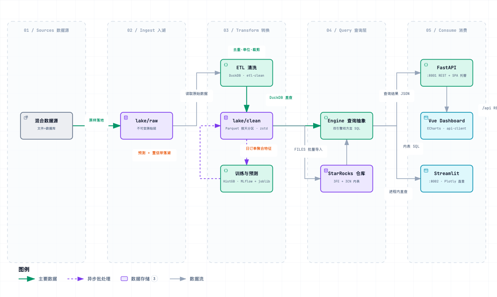

# data-platform-monorepo

数据分析平台 Monorepo Demo：现代数据湖（Parquet）+ ETL 清洗 + 双引擎查询（DuckDB | StarRocks）+ 双 Dashboard（Vue 3 | Streamlit）+ 模型训练与预测（MLflow）。零容器、零网关，单机可完整运行，接 StarRocks 集群只需改配置。

## 架构



> 交互版（主题切换、聚焦视图、导出）：[docs/architecture.html](docs/architecture.html)，规格源文件 [docs/architecture.json](docs/architecture.json)

```
混合数据源(CSV/SQLite/Excel ~1GB)
  → lake/raw 原始层(不可变)
  → ETL 清洗(DuckDB: 去重/单位统一/量程裁剪/缺失填充)
  → lake/clean(Parquet 按天分区, zstd, ~166MB)
      ├→ Engine 查询抽象(DuckDB 直查 | StarRocks FILES 导入内表)
      │     ├→ FastAPI :8001 → Vue 3 + ECharts Dashboard
      │     └→ Streamlit :8002(进程内直查, 缓存 5min)
      └→ 训练(HistGradientBoosting + MLflow) → 7 天预测落湖 → 看板预测页
```

## 目录结构

```
├── apps/
│   ├── etl/                  数据生成(gen-data) + 清洗落湖(etl-clean) + StarRocks 导入(sr-load)
│   ├── training/             日订单量训练(train) + 递归预测(predict)
│   ├── api/                  FastAPI 查询服务 :8001, 生产同进程托管 Vue dist
│   ├── dashboard/            Vue 3 + Vite + ECharts 看板
│   └── streamlit-dashboard/  Streamlit 看板 :8002(与 Vue 版逐页对齐, 用于选型对比)
├── packages/
│   ├── data-core/            配置 / 湖路径约定 / Engine 双引擎抽象 / 双方言 SQL
│   └── api-client/           类型化 TS 查询客户端
├── config/settings.example.toml   配置模板(复制为 settings.toml, 已 gitignore)
├── sql/starrocks_schema.sql       StarRocks DDL
├── lake/                           数据湖(gitignore): raw/ + clean/
└── Makefile                        统一入口
```

## 快速开始

前置：Python 3.12+、[uv](https://docs.astral.sh/uv/)、Node 18+、pnpm。

```bash
uv sync --all-packages      # Python workspace 全部依赖
pnpm install                # TS 侧依赖

make pipeline               # 生成 ~1GB 演示数据 → 清洗落湖 → 训练 → 预测

make api                    # FastAPI :8001
make web                    # Vue dev :5173(/api 代理到 8001)
make st                     # Streamlit :8002
```

生产形态（10 人左右并发）：`make build` 后 `uv run uvicorn api.main:app --port 8001` 单进程同时服务 REST API 与 Vue 静态页；Streamlit 由 `make st` 独立进程提供。

## 双引擎

| 模式 | 条件 | 说明 |
|---|---|---|
| DuckDB（默认） | 无 | 直接查询 lake/clean 的 Parquet，零外部依赖 |
| StarRocks | `settings.toml` 中 `[starrocks] enabled = true` | `make sr-schema && make sr-load && make sr-verify`：FILES 直读湖上 Parquet 入内表并做行数对账，API 自动切换引擎 |

湖根切换对象存储：`[lake] root = "s3://bucket/prefix"` + endpoint/AK/SK（建议用环境变量 `DP_LAKE_ROOT` / `DP_LAKE_AK` / `DP_LAKE_SK` 等，优先级高于 toml）。

## 双 Dashboard 对比

| 维度 | Vue 3 + ECharts | Streamlit |
|---|---|---|
| 数据路径 | 浏览器 → FastAPI → Engine | 浏览器 → Streamlit 进程内直查 Engine |
| 迭代速度 | 改前端需构建，图表逻辑在 TS | 纯 Python，保存即刷新 |
| 部署 | FastAPI 托管 dist，1 进程 | streamlit run 1 进程，零构建 |
| 适用 | 对外/正式产品化看板 | 部门内探索分析、快速原型 |

两套看板页面逐一对齐：概览（KPI + 订单趋势 + 品类收入）、传感器分析（小时级时序 + z-score 异常检测）、订单预测（历史 vs 预测 + 95% 置信带）。建议：Streamlit 快速验证分析思路，稳定看板沉淀到 Vue 版，两者共享同一湖与查询层。

## 演示数据与可验证结果

合成数据注入了明确的"待发现"模式，全链路可量化验证：

- 清洗：单位修正 150,608 行（10% 订单金额误记为"分"）、订单号去重 1,254 行、电压量程裁剪 8,656 条、温度缺失前值填充 25,056 条
- 异常检测：设备内日均值 z-score > 2 且绝对偏离 > 0.5°C，精确命中 D-07 注入的 21 天 +3°C 漂移，48 设备 × 180 天零误报
- 预测：14 天前向验证 MAE=771 / MAPE=7.48% / R²=0.871；周末 ×1.6 模式被正确学习

## 工具链

Python：uv（包管理）+ ruff（`make fmt` / `make check`）；TS：pnpm + Turborepo（`pnpm run build` / `check`）。
